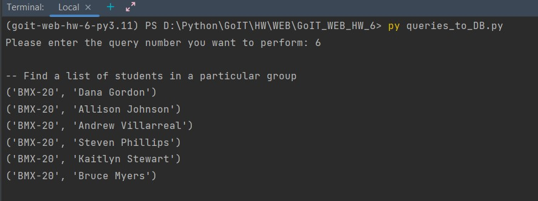

# GoIT_WEB_HW_6
Individual work №6 at the GoIT school; using SQLite, creating tables, queries to DB

## Description
Here it is implemented a SQLite database in which 5 tables are created.
These are a table of university students, a table of groups, a table of teachers, a table of subjects, and a table of grades.
The tables are created using python code and are automatically populated with fake data. 

After creating the database and filling it with data, you can make SQL queries to the database.
All SQL queries are stored in the SQLite folder in this repository and can be run either in the SQL editor console or using Python.

## Running the program

To start working with the database you need:

• Clone this repository to your PC. To do this, run the command line and type
```
git clone https://github.com/S-Stepanov-1/GoIT_WEB_HW_6.git
```
• After that you need to install the dependencies. Use command
```
poetry init
```
• Now you can create the database
```
py create_tables.py
```
####  You will have the following Entity-Relationship model


• And fill it with fake data
```
py seed_tables.py
```
• To query the database you have to run the `queries_to_DB.py` file and follow the instructions to enter the number of the query you want to perform. 
```
py queries_to_DB.py
```
#### Program work example

